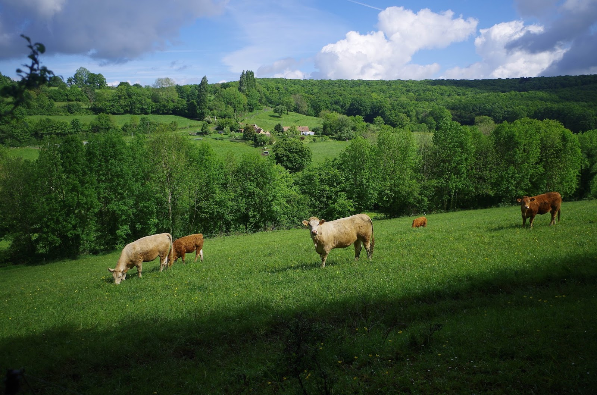

# quanticampagnes

Des analyses cartos sur la diversité des campagnes françaises.
L'appli est en ligne [ici](https://mtmx.github.io/blog/appli_campagnes/) accompagnée de quelques cartes présentant les indicateurs.

## Scripts :

* **appli shiny** : appli_data.R
* **analyse de l'altitude** : carto_alti_decli.R + carto_alti.Rmd
* **analyse de la géographie des cheptels** : cheptels_agreste.R + grille_animaux.R + carto_cheptels.Rmd
* **analyse de la pluviométrie** : meteofrance_pluie.R + carto_meteo.Rmd

Meuhh

